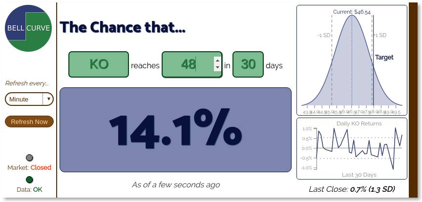

# BellCurve

BellCurve is an open source desktop application that helps public stock market investors estimate the probability of stock price moves.

## How to install

**Linux**

1. Download the Linux-binary
2. Launch application by double-clicking on the downloaded file

**All Operating Systems**

1. Clone this repository
2. Install dependencies from project root directory using `npm install`
3. Launch application using `npm start`

## How to use it

Using BellCurve is quite easy. Enter a ticker, select a target price, and select a time frame and let BellCurve handle everything else.

## How BellCurve works behind the scenes

Behind the scenes, BellCurve calculates the historical daily prices moves, summarizes potential moves using the normal and lognormal distributions, and then estimates the probability of target moves.

## Why BellCurve exists

BellCurve exists because many public stock market investors require context to assist in their investing activity. Some investors want to time their entry or exit trades in order to place a position with a good chance of succeeding. Other investors analyze options and would like to know the potential range of stock price movements before implementing a trading strategy. In each case, _context_ for potential price movements helps investors make intelligent decisions.
